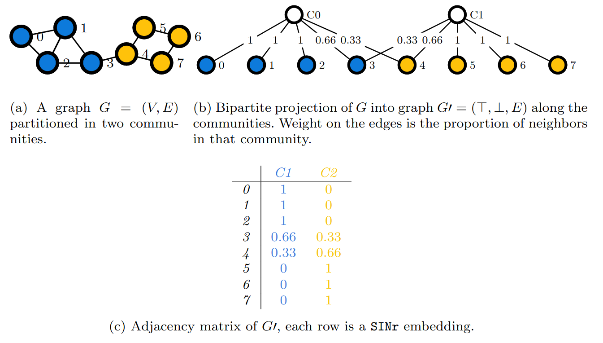

---
title: 'SINr: a python package to train interpretable word
and graph embeddings'
tags:
  - Python
  - computer science
  - natural language processing
  - graphs
  - social networks analysis
authors:
  - name: Thibault Prouteau
    orcid:  0000-0001-9610-3191
    equal-contrib: false
    corresponding: true
    affiliation: 1
  - name: Nicolas Dugué
    orcid:  0000-0002-6150-1939
    corresponding: true
    equal-contrib: false
    affiliation: 1
  - name: Simon Guillot
    equal-contrib: false
    affiliation: 1
  - name: Anthony Perez
    corresponding: false
    equal-contrib: false
    affiliation: 2
affiliations:
 - name: Le Mans Université, LIUM, EA 4023, Laboratoire d'Informatique de l'Université du Mans, France
   index: 1
 - name: Univ. Orléans, INSA Centre Val de Loire, LIFO EA 4022, Orléans, France
   index: 2

date: 22 february 2023
bibliography: paper.bib

---

# Summary

In this paper, we introduce the SINr Python package to train word and graph embeddings. Word embeddings allows to encompass the meaning of words into vectorial representations that can be used by algorithms. The principle has then been transfered to the study of graphs, mathematical representations that represent entities of the real words and their relations (social networks for instance). Those vectors encompassing information are often the first building block of more complex artificial intelligence pipelines. With SINr, we focus on providing frugal and interpretable algorithms to build this first building block. Indeed, because of the growing complexity of the algorithms used in artificial intelligence (deep learning), frugality and interpretability became major issues. The SINr approach is based on community detection: a vector for a node is built upon the distribution of its connections through the communities detected on the graph at hand. The algorithm thus runs very fast, and does not require GPUs to proceed which allows a broad usage. Furthermore, the dimensions of the embedding space are interpretable, those are based on the communities extracted. One can thus interact with the dimensions of the vectors and inspect the meaning of the representation. 

# Statement of need and functionalities

SINr package can be used in the field of natural language processing (NLP), digital humanities, or networks analysis. It allows to represent words and networks entities as vectors in mathematical spaces named embedding spaces.

With neural approaches, tremendous progress was made in NLP, notably to represent the vocabulary of the language at hand, those representations are then used as input for machine learning algorithms. These representations are dense numeric vectors named word embeddings. Some examples of approaches to train such vectors using large textual corpora are Word2vec [@mikolov2013efficient], GloVe [@pennington2014glove], and the Transformer-based approached for contextualized representations, Camembert [@martin2019camembert] or Flaubert [@le2019flaubert] in French. This progress was transfered to the graph universe, allowing the emergence of graph embedding, a whole field of research with Word2vec inspired approaches such as Node2vec [@grover2016node2vec], matrix factorization methods like HOPE [@ou2016asymmetric] and auto-encoding paradigms [@cao2016deep].

SINr was introduced to take advantage of this progress, it allows to embed words and nodes just like the aforementioned methods. However, it is based on community detection: for each node, the vector of embedding is calculated as the proportion of its links going to the communities as described \autoref{fig:2}. This approach allows to avoid some flaws inherent to the usual approaches:

- As far as we know, SINr is the first approach specifically designed to deal with both word and graph embeddings. Textual corpora are represented as graphs, and with the adequate preprocessing provided by the package, word embeddings can easily be extracted with SINr. For graph embedding, no specific pre-processing is required.
- Contrary to the neural approaches that require complex GPU calculations, SINr is based on the Louvain [@blondel2008fast]
 algorithm to detect community and thus runs in linear-time, it can be executed on standalone laptops. Still, it can easily be interfaced with the gensim package for word embedding, or with the karateclub one for graph embedding for instance.
- Contrary to the usual approaches, because dimensions are based on the communities, the space in which words and graphs are embedded with SINr is interpretable.

Design patterns were used to allow the usage of SINr with graphs or text in the same manner, which makes it -as far as we know- the first package to deal by design with both of these data types. For usage in the context of digital humanities or NLP, standard preprocessing algorithms are also provided, mostly relying on spacy. Finally, the most important aspect of SINr is that it allows to interact with the embedding space. SINr brings the option to probe and get an understanding of the resulting embedding space as one can see \autoref{fig:1}. Indeed, using SINr leads to sparse vectors: a node is not connected to all the communities of a graph, and similarly, a word is not related to all the topics of a corpus. As shown by @subramanian2018spine, sparsity is one of the features required to enforce interpretability. 

# Performances of the SINr approach
The performances of SINr were evaluated on several tasks, including link prediction on graphs, and pair of words similarities for textual data in @prouteau2021sinr. While providing good performances, it runs faster than most of the other embedding approaches. Furthermore, the interpretability of the model was also demonstrated to be comparable to the state-of-the-art when considering word embedding [@prouteau2022embedding]. 

# Availability

The SINr package is distributed on \url{https://github.com/SINr-Embeddings/sinr} with its [documentation](https://sinr-embeddings.github.io/sinr/) and [notebooks](https://github.com/SINr-Embeddings/sinr/tree/main/notebooks). It can also be found on [Pypi](https://pypi.org/project/sinr/) to be installed with pip.

# Scope and Alternatives

For graph embedding, the Karateclub library designed by @rozemberczki2020karate allows to try and test recent approaches. However, so far, none of them is known to be as fast as SINr or interpretable. For statistical semantics on textual Corpora, the gensim package [@vrehuuvrek2011gensim] is still a good option. For more recent approaches, the Flair [@akbik2019flair] and Spacy [@vasiliev2020natural] packages can be used, allowing to build complete NLP pipelines. SINr embeddings can actually be used complementary to these packages.

# Acknowledgements

This research benefited from the support of the ANR project 'Dynamic and Interpretable Graph-based word embeddINGs' (ANR-21-CE23-0010).

# References

